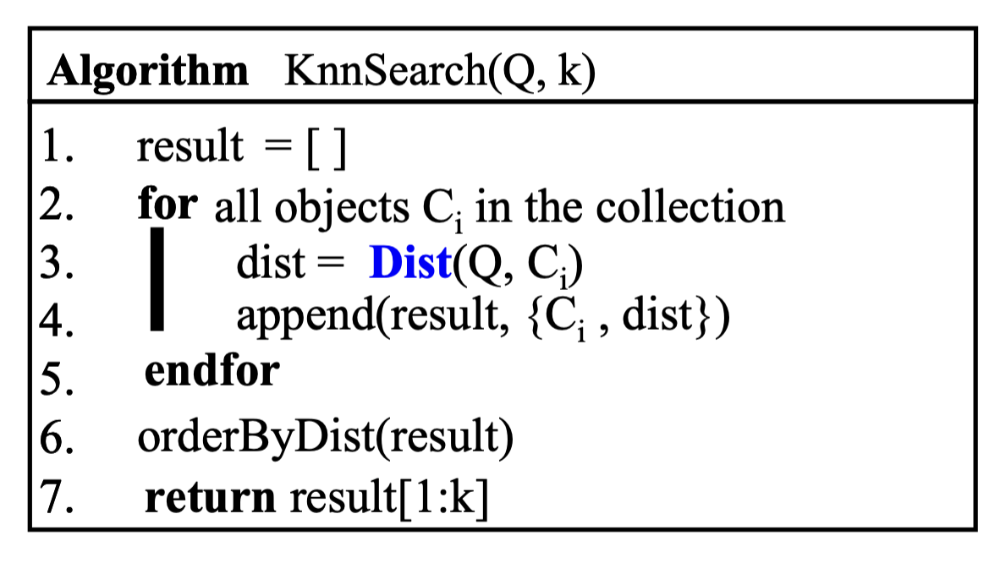
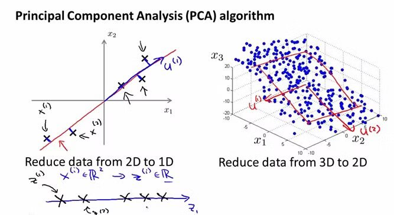
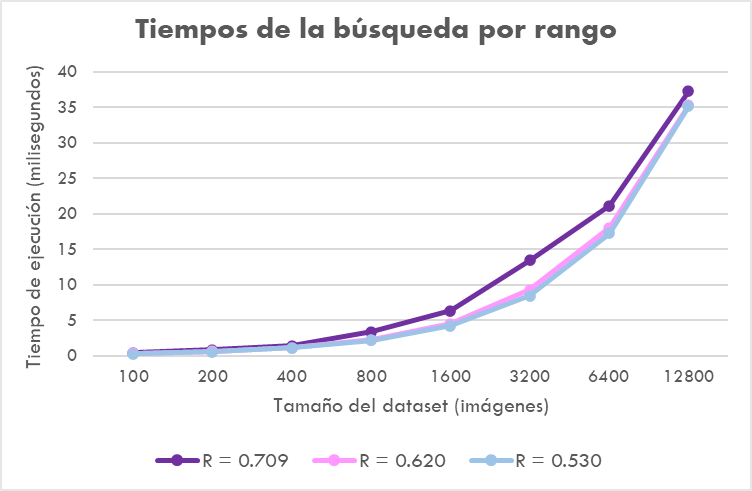
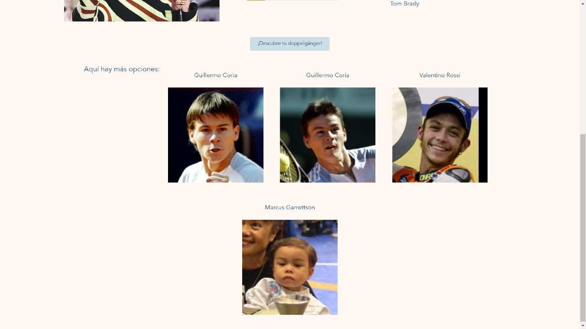

# Proyecto 3 - Bases de Datos II

### Integrantes
* Valeria Espinoza Tarazona (202110109)
* Enzo Camizán Vidal (202110047)
* Diego Guerra Chevarría (202010137)
* Valentín Quezada Amour (202120570)
* Sofía García Quintana (202110567)

## Descripción del producto  
Nuestro producto es de un sistema de búsqueda y recuperación de datos multimedia con un enfoque en la búsqueda de imágenes, comparando muchos índices y su eficiencia. 
Permitirá a los usuarios poder subir una foto propia o cualquiera, y poder obtener las fotos más similares a la enviada dentro de un dataset de fotos de famosos.
El objetivo será permitir al usuario descubrir imágenes similares a través de sus características.
Finalmente, vale mencionar que el programa está diseñado para soportar grandes volúmenes de datos.

El programa utiliza los algoritmos de búsqueda KNN-Secuencial y KNN-RTree para asegurar que los resultados sean los más precisos, eficientes en un corto tiempo Adicionalmente, nos enfocamos en la eficiencia y precisión de los resultados utilizando los índices multidimensionales del tipo High-D: el KNN-KDTree y el KNN-Faiss.  

<div align="center">
 
</div>  

## Descripción del dominio de datos  
Para la construcción de nuestra página, utilizamos la colección de referencia pública 'Labeled Faces in the Wild' de la Universidad de Massachusetts Amherstdataset para la verificación facial, también conocida como coincidencia de pares. Esta consiste en una colección de carpetas identificadas por el nombre de personas, cuyo contenido son imágenes (o imagen) de la misma. La estructura es la siguiente:  

```bash
./images/
├── Aaron_Eckhart/
├── Aaron_Guiel/
├── Aaron_Patterson/
├── ...
└── Zydrunas_Ilgauskas/
```
## Extracción de características  
Para la extracción de características, utilizamos principalmente dos funciones de la librería **Face Recognition**: *face_encodings* y *load_image_file*. Hallamos el vector característico de tamaño 128 de cada imagen del dataset. Para no realizar el dicho proceso reiteradamente, vamos a guardar el vector característico de cada imagen en un json, con el siguiente formato:  

> {"../images/German_Khan/German_Khan_0001.jpg": [-0.04473418742418289, 0.16433686017990112, ...], ...}

Para ello, usamos el siguiente código:  

```python
images_directory = os.path.join(os.path.dirname(__file__), "../images")
    with open("encoded_faces.json", "w") as json_file:
        dictionary = {}
        for root, subdirectories, files in os.walk(images_directory):
            for file in files:
                path = os.path.join(root, file)
                if os.path.basename(file) != ".DS_Store":
                    image = face_recognition.load_image_file(path)
                    face_encod_vector = face_recognition.face_encodings(image)

                    if len(face_encod_vector) > 0:
                        dictionary[path] = (face_encod_vector[0]).tolist()
                    
```


## KNN-Secuencial


### Usando Priority Queue
Para la implementación de este algoritmo, nos basamos en el siguiente pseudocódigo:  
<div align="center">
 
</div>  

Para hacerlo más eficiente, lo adaptamos para usar una cola de prioridad, teniendo siempre como elemento de mayor prioridad a aquella imagen cuya distancia es menor. Es así que evitamos hace un sort al arreglo result, sino que ya tenemos al heap en orden. Así quedó nuestra implementación.  

```python
def knn_pq(faces_encoding, dataset, k):
    result = []
    for path, matrix_vector_faces in dataset:
        for distance in face_recognition.face_distance(matrix_vector_faces, faces_encoding):
            #result.append((os.path.basename(path), distance))
            pq.heappush(result, (distance, formateoPath(path, ERES_VALERIA)))

    resultK = pq.nsmallest(k , result)

    return [formateoPath(path, ERES_VALERIA) for distance, path in resultK]
```

### Range Search  
Para el análisis de la distribución de las distancias, empleamos la regla empírica, también conocida como la regla de los 68-95-99.7, la cual se basa en la distribución normal y establece que aproximadamente el 68% de los datos se encuentran dentro de una desviación estándar de la media, el 95% se encuentran dentro de dos desviaciones estándar y el 99.7% se encuentran dentro de tres desviaciones estándar. En base a ello calculamos el promedio y desviación estándar de todas las distancias, considerando la imagen en 'test/teofilo.png' como base.  

**Calculamos la media y la desviación estándar**

```python
def distances(dataset):
    vector_dist = []
    for path, matrix_vector_faces in dataset:
        for distance in face_recognition.face_distance(matrix_vector_faces, faces_encoding[0]):
            vector_dist.append(distance)
    print(vector_dist)

    return list((np.mean(vector_dist), np.std(vector_dist)))
```

**Calculamos los tres radios**

```python
def select_representative_radii(mean_distance, std_distance):
    # regla empírica
    r1 = mean_distance - std_distance
    r2 = mean_distance - 2 * std_distance
    r3 = mean_distance - 3 * std_distance

    return [r1, r2, r3]
```

Obtuvimos los siguientes tres radios:  
```python
[0.7091430536563229, 0.6196988488962061, 0.5302546441360892]
```  

Para el algoritmo, tomamos como referencia el siguiente pseudogódigo:  

<div align="center">
 
</div>

Esta fue nuestra implementación:  
```python
def range_search(faces_encoding, dataset, radio):
    result = []
    for path, matrix_vector_faces in dataset:
        for distance in face_recognition.face_distance(matrix_vector_faces, faces_encoding):
            if distance < radio:
                result.append(( formateoPath(path, ERES_VALERIA), distance))

    if len(result):
        result = sorted(result, key = lambda x: x[1])
        return [path for path, dis in result]
```

## KNN-RTree

Un método de búsqueda que permite esencialmente clasificar valores buscando los puntos más cercanos o más similares. Además, es un índice multidimensional.
Se destaca por la búsqueda de rango por ser muy similar al Btree.

```python
def knn_rtree(faces_encoding, dataset, k, n):
    # Configurar las propiedades del índice R-tree
    properties = rtree.index.Property()
    properties.dimension = 128  # Tamaño del vector característico
    properties.buffering_capacity = 8
    # Crear el índice R-tree
    idx = rtree.index.Index("./knn/rtree/rtree_feat_vector_"+str(n), properties=properties)

    # Construir el índice si está vacío
    if idx.get_size() < 1:
        c = 0
        for path, matrix_vector_faces in dataset:
            q = tuple(matrix_vector_faces)
            idx.insert(c, q)
            c+=1

    # Realizar la consulta kNN
    query = tuple(faces_encoding[0])
    results = list(idx.nearest(coordinates=query, num_results=k))
    # Obtener las rutas de los resultados
    return [formateoPath(dataset[i][0], path) for i in results[:k]]

```


## KNN-HighD
###  KD-Tree

Una estructura de datos muy útil para una búsqueda que involucran una clave de búsqueda multidimensional, como la búsqueda de rangos o de los vecinos más cercanos.
Es recomendado no usar altas dimensiones porque hace que el algoritmo visite muchas más ramas y el espacio entre los puntos aumenta de manera exponencial, haciendo que haya mayor overlap entre distintas particiones.

La manera en la que lo implementamos fue aprovechando la libreria de scikit-learn que ya tenia implementada una estructura de KDTree.

Construimos el indice de tal manera que lo adaptamos a como tenemos el dataset lleno de sets de (path, encodings).

```python
from sklearn.neighbors import KDTree

def KDTree_index(dataset):
    # 1- construccion del indice
    lst = []
    for path, matrix_vector_faces in dataset:
        lst.append(matrix_vector_faces)
    ind = KDTree(lst, leaf_size=2)
    return ind
```

Y despues en el search, en base al indice creado, haciamos la query de tal manera que recibieramos el path de los K elementos mas cercanos.

```python
def FaissIndex_Search(query, dataset, k, n):
    q = np.reshape(np.array(query,dtype='f'), (1,128))
    ind = faiss.read_index("./knn/faiss/faiss_feat_vector_"+str(n)+".idx")
    n, indx = ind.search(q, k=k)
    indx = indx[0].astype(int)
    results = []
    for i in indx:
        pathToSave = formateoPath(dataset[i][0], path)
        results.append(pathToSave)
        return results
```

### Faiss (HNSW)

Faiss es una librería de búsqueda de similitud que destaca por el uso de memoria y rápido procesamiento de datos. Esta librería está implementada por un grupo de Research de Facebook, y por eso el nombre de Faiss viene de Facebook AI Similarity Search. La idea de esta librería es proporcionar índices ya implementados que agilicen y aceleren la búsqueda de vecinos cercanos para grandes cantidades de datos y en altas dimensionalidades.

De la librería Faiss, aprovechamos el índice HNSW (Hierarchical Navigable Small Worlds). Este índice es de tipo grafo de proximidad en algoritmos de redes neuronales artificiales. En resumen, es un grafo en el que dos vértices están conectados en función de su proximidad (distancia), de tal manera que se crea una estructura jerárquica de grafos.

Cada nodo está conectado con otros nodos cercanos en el espacio, de tal manera que los vecinos más cercanos están conectados de manera directa, para que se forme un "small world". Así podemos acceder de manera rápida a los vecinos cercanos.

<div align="center">
 
</div>

Primero, construimos el indice con 128 dimensiones. En caso ese indice ya exista, lo borramos y lo creamos de nuevo.

```python
def buildFaissIndex(n, dataset):
    pathFolder = "./knn/faiss/"
    if os.path.exists(pathFolder+"faiss_feat_vector_"+str(n)+".idx"):
        os.remove(pathFolder+"faiss_feat_vector_"+str(n)+".idx") 
    sample_dict = {}

    for path, matrix_vector_faces in dataset:
        sample_dict[formateoPath(path)]= matrix_vector_faces

    vector = []
    for key in sample_dict: 
        vector.append(np.array(sample_dict[key], dtype='f'))
    vector = np.array(vector, dtype='f')
    M = 32
    ef_search = 8
    d = 128

    ind  = faiss.IndexHNSWFlat(d,M)
    ind.hnsw.efConstruction = 40
    ind.hnsw.efSearch = ef_search

    ind.add(vector)

    faiss.write_index(ind, "./knn/faiss/faiss_feat_vector_"+str(n)+".idx")
```

Después, el search, necesita que el vector de la query se adapta a las dimensiones que pide faiss.

```python
def FaissIndex_Search(query, dataset, k, n):
    q = np.reshape(np.array(query,dtype='f'), (1,128))
    ind = faiss.read_index("./knn/faiss/faiss_feat_vector_"+str(n)+".idx")
    n, indx = ind.search(q, k=k)
    indx = indx[0].astype(int)
    results = []
    for i in indx:
        pathToSave = formateoPath(dataset[i][0])
        results.append(pathToSave)
    return results
```


### Maldición de la dimensionalidad
La maldición de la dimensionalidad tiene un gran impacto en las técnicas de búsqueda o de aprendizaje. 
Ocurre cuando la distancia media entre los datos aumentan con el número de dimensiones.

Esto se evidencia mejor con el siguiente ejemplo:
Se escogen 100 puntos para 1 dimensión, y se puede apreciar cuáles puntos están cerca y cuáles lejos:

<div align="center">
 
</div>

Y cuando comparamos para una dimensión mayor, ya no es tan fácil apreciar los puntos cercanos comparado con el de una dimensión:

<div align="center">
 
</div>

Entonces, si bien el uso de múltiples variables puede mejorar la predicción en modelos, siempre se debe asegurar que todas las variables (dimensiones) que se usan sean buena predictoras para el modelo que queremos.

**Solución**

Existen métodos de reducción de dimensionalidad para acelarar el entrenamiento de modelos y algoritmos. Entre ellos, están distintos métodos como la Transformada Discreta de Fourier o el Principal Component Analysis (PCA).

En el caso del PCA, por ejemplo, logra proyectar los datos en un espacio de menor dimension que retiene la mayor parte de la variación entre los datos.


<div align="center">
 
</div>

## Experimentación  
Manteniendo un valor de K = 8, realizamos una serie de experimentos para distintos tamaños del dataset. Probamos y medimos los tiempos para cada índice implementado y lo mostramos en la tabla a continuación:

| N size   | KNN-Secuencial | KNN-RTree   | KNN-KDTree  | KNN-Faiss  |
|----------|------------------|-------------|------------|------------|
| N=100    | 0.78297          | 1.76716     | 0.28610    | 0.75793    |
| N=200    | 1.46412          | 2.60305     | 2.19416    | 0.43607    |
| N=400    | 3.54099          | 1.90997     | 0.98920    | 0.32902    |
| N=800    | 6.77585          | 3.50595     | 0.90504    | 0.35405    |
| N=1600   | 11.95478         | 7.05003     | 1.42908    | 0.45395    |
| N=3200   | 21.57902         | 14.25099    | 2.79713    | 0.83518    |
| N=6400   | 38.80596         | 27.48990    | 5.33104    | 1.63794    |
| N=12800  | 77.79407         | 56.04196    | 10.74505   | 2.81882    |

> Tiempo en milisegundos

<div align="center">
 
</div>


### Análisis de resultados

**KNN-Secuencial:** El tiempo de ejecución aumenta poco a poco a medida que aumenta N, pues algoritmo hace una búsqueda secuencial en todo el conjunto de datos, lo que se vuelve mucho más costoso a medida que aumenta el tamaño de los datos.

**KNN-RTree:** Para N pequeños, el tiempo de ejecución es mayor. A medida que el tamaño del conjunto de datos aumenta, el tiempo de ejecución disminuye significativamente, pues el R-Tree indexa los datos para realizar búsquedas más rápidas a medida que el conjunto de datos se vuelve más grande.

**KNN-KDTree:** Tiene un tiempo de ejecución muy bajo para conjuntos de datos pequeños, pero a medida que el tamaño del conjunto de datos aumenta, el tiempo de ejecución también aumenta. A medida que el tamaño del conjunto de datos aumenta, es posible que el algoritmo tenga dificultades para manejar la alta dimensionalidad y su rendimiento se ve afectado.

**KNN-Faiss:** Muestra el tiempo de ejecución más bajo en comparación con los otros algoritmos para todos los tamaños de conjunto de datos. Faiss es una biblioteca de búsqueda de vectores de alta eficiencia y está especialmente diseñada para conjuntos de datos grandes y de alta dimensionalidad, lo que permite realizar búsquedas KNN de manera rápida y eficiente.

### Búsqueda por rango

Para la búsqueda por rango, realizamos nuevos experimentos con tres radios distintos. Los resultados con los tres radios fueron los siguientes:  

| N size   | R=0.709143053656 | R=0.6196988489  | R=0.53025464414|
|----------|------------------|-----------------|----------------|
| N=100    | 0.42200          | 0.31304         | 0.27704        |
| N=200    | 0.81396          | 0.59199         | 0.54884        |
| N=400    | 1.42288          | 1.13201         | 1.10388        |
| N=800    | 3.34692          | 2.25901         | 2.16603        |
| N=1600   | 6.34697          | 4.53401         | 4.22215        |
| N=3200   | 13.4139          | 9.28187         | 8.44812        |
| N=6400   | 21.13604         | 18.03303        | 17.24171       |
| N=12800  | 37.28199         | 35.25496        | 35.14004       |

<div align="center">
 
</div>

## Frontend
Para la interfaz de nuestro programa, implementamos una GUI usando el lenguaje de programación JavaScript con el framework de Vue. La conexión entre el backend y el frontend se realizó con apoyo de una API.

### Desarrollo de la API
La API desarrollada contó con un endpoint principal y 4 endpoints auxiliares que llamaron a cada una de las estructuras implementadas: KNN-Secuencial, KNN-RTree, KNN-KDTree y KNN-Faiss. Cada endpoint recibe un file (imagen) y un entero (k) que luego trabajará para devolver las k imágenes del dataset que más se parecen a la imagen enviada, según el índice trabajado.

### Evidencias del frontend
<div align="center">
 
</div>

<div align="center">
 
</div>

## Conclusiones
Los resultados muestran que el rendimiento de los algoritmos KNN varía según el tamaño del conjunto de datos y las características de los datos. Algunos algoritmos son más eficientes en conjuntos de datos grandes, mientras que otros pueden ser más adecuados para conjuntos de datos de alta dimensionalidad.

Se pudo implementar una variedad de algoritmos optimizados e índices multidimensionales y se pudo comparar la eficiencia de cada uno y los recursos que utilizando, además de la precisión.

Poder tener una estabilidad y adaptabilidad del programa para manejar adecuadamente grandes volúmenes de datos.

Se puedo concluir que KNN-Faiss es un buen índice de búsqueda, por ser eficiente, y ser capaz retornar el resultado en poco tiempo comparados con los demás índices.

Se pudo observar que el KNN-Secuencial es el menos eficiente comparado con los demás índices.