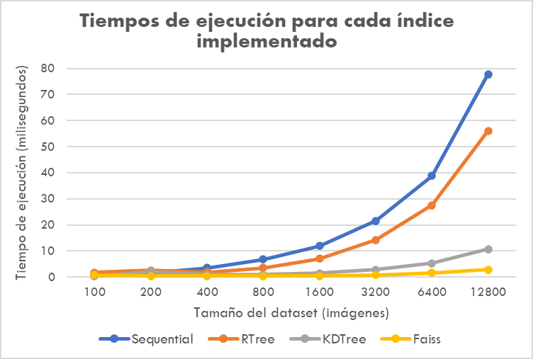

# PROYECTO 3 : Base de Datos Multimedia  
### Integrantes
* Valeria Espinoza Tarazona (202110109)
* Enzo Camizán Vidal (202110047)
* Diego Guerra Chevarría (202010137)
* Valentín Quezada Amour (202120570)
* Sofía García Quintana (202110567)

## Descripción del producto  
## Dataset  
Para la construcción de nuestra página, utilizamos la colección de referencia pública 'Labeled Faces in the Wild' de la Universidad de Massachusetts Amherstdataset para la verificación facial, también conocida como coincidencia de pares. Esta consiste en una colección de carpetas identificadas por el nombre de personas, cuyo contenido son imágenes (o imagen) de la misma. La estructura es la siguiente:  

```bash
./images/
├── Aaron_Eckhart/
├── Aaron_Guiel/
├── Aaron_Patterson/
├── ...
└── Zydrunas_Ilgauskas/
```
## Extracción de características  
Para la extracción de características, utilizamos principalmente dos funciones de la librería **Face Recognition**: *face_encodings* y *load_image_file*. Hallamos el vector característico de tamaño 128 de cada imagen del datasetsPara no realizar el proeso de cálculo del vector caracteri

```python
images_directory = os.path.join(os.path.dirname(__file__), "../images")
    with open("encoded_faces.json", "w") as json_file:
        dictionary = {}
        for root, subdirectories, files in os.walk(images_directory):
            for file in files:
                path = os.path.join(root, file)
                if os.path.basename(file) != ".DS_Store":
                    image = face_recognition.load_image_file(path)
                    face_encod_vector = face_recognition.face_encodings(image)

                    if len(face_encod_vector) > 0:
                        dictionary[path] = (face_encod_vector[0]).tolist()
                    
```


## KNN-Secuencial


### Using Priority Queue


### Range Search  
Para el análisis de la distribución de las distancias, empleamos la regla empírica, también conocida como la regla de los 68-95-99.7, la cual se basa en la distribución normal y establece que aproximadamente el 68% de los datos se encuentran dentro de una desviación estándar de la media, el 95% se encuentran dentro de dos desviaciones estándar y el 99.7% se encuentran dentro de tres desviaciones estándar. En base a ello calculamos el promedio y desviación estándar de todas las distancias, considerando la imagen en 'test/teofilo.png' como base.  

**Calculamos la media y la desviación estándar**

```python
def distances(dataset):
    vector_dist = []
    for path, matrix_vector_faces in dataset:
        for distance in face_recognition.face_distance(matrix_vector_faces, faces_encoding[0]):
            vector_dist.append(distance)
    print(vector_dist)

    return list((np.mean(vector_dist), np.std(vector_dist)))
```

**Calculamos los tres radios**

```python
def select_representative_radii(mean_distance, std_distance):
    # regla empírica
    r1 = mean_distance - std_distance
    r2 = mean_distance - 2 * std_distance
    r3 = mean_distance - 3 * std_distance

    return [r1, r2, r3]
```

Obtuvimos los siguientes tres radios:  
```python
[0.7091430536563229, 0.6196988488962061, 0.5302546441360892]
```  

Para el algoritmo, tomamos como referencia el siguiente pseudogódigo:  

<div align="center">
 
</div>

Esta fue nuestra implementación:  
```python
def range_search(faces_encoding, dataset, radio):
    result = []
    for path, matrix_vector_faces in dataset:
        for distance in face_recognition.face_distance(matrix_vector_faces, faces_encoding):
            if distance < radio:
                result.append(( formateoPath(path, ERES_VALERIA), distance))

    if len(result):
        result = sorted(result, key = lambda x: x[1])
        return [path for path, dis in result]
```


## KNN-HighD
###  KD Tree

Una estructura de datos muy útil para una búsqueda que involucran una clave de búsqueda multidimensional, como la búsqueda de rangos o de los vecinos más cercanos.
Es recomendado no usar altas dimensiones porque hace que el algoritmo visite muchas más ramas que en espacio de menor dimensionalidad


```python
    def FaissIndex_Search(query, dataset, k, n):
        q = np.reshape(np.array(query,dtype='f'), (1,128))
        ind = faiss.read_index("./knn/faiss/faiss_feat_vector_"+str(n)+".idx")
        n, indx = ind.search(q, k=k)
        indx = indx[0].astype(int)
        results = []
        for i in indx:
            pathToSave = formateoPath(dataset[i][0], path)
            results.append(pathToSave)
            return results
```


### Faiss (HNSW)

Faiss es una librería de búsqueda de similitud que destaca por el uso de memoria y rápido procesamiento de datos
Muy útil para aplicaciones que requieren búsquedas rápidas con muchos datos

```python
def FaissIndex_Search(query, dataset, k, n):
    q = np.reshape(np.array(query,dtype='f'), (1,128))
    ind = faiss.read_index("./knn/faiss/faiss_feat_vector_"+str(n)+".idx")
    n, indx = ind.search(q, k=k)
    indx = indx[0].astype(int)
    results = []
    for i in indx: #Considerar que pasa si subes una foto de alguien que ya esta en la bd
        pathToSave = formateoPath(dataset[i][0], ERES_VALERIA)
        results.append(pathToSave)
    return results

```

### Maldición de la dimensionalidad
Incluir imágenes/diagramas para una mejor comprensión

## Experimentación  
Manteniendo un valor de K = 8

| N size   | KNN-SecuencialPQ | KNN-RTree   | KNN-HighD  | KNN-Faiss  |
|----------|------------------|-------------|------------|------------|
| N=100    | 0.78297          | 1.76716     | 0.28610    | 0.75793    |
| N=200    | 1.46412          | 2.60305     | 2.19416    | 0.43607    |
| N=400    | 3.54099          | 1.90997     | 0.98920    | 0.32902    |
| N=800    | 6.77585          | 3.50595     | 0.90504    | 0.35405    |
| N=1600   | 11.95478         | 7.05003     | 1.42908    | 0.45395    |
| N=3200   | 21.57902         | 14.25099    | 2.79713    | 0.83518    |
| N=6400   | 38.80596         | 27.48990    | 5.33104    | 1.63794    |
| N=12800  | 77.79407         | 56.04196    | 10.74505   | 2.81882    |

> Tiempo en milisegundos

<div align="center">
 
</div>
Para la búsqueda por rango, los resultados con los tres radios diferentes fueron los siguientes:  

| N size   | R=0.709143053656 | R=0.6196988489  | R=0.53025464414|
|----------|------------------|-----------------|----------------|
| N=100    | 0.00034403801    | 0.00055289268   | 0.00029206276  |
| N=200    | 0.00058722496    | 0.00089192390   | 0.00054407120  |
| N=400    | 0.00118684769    | 0.00143218040   | 0.00104498863  |
| N=800    | 0.00397062302    | 0.00341296196   | 0.00213003159  |
| N=1600   | 0.00618696213    | 0.00604581833   | 0.00469493866  |
| N=3200   | 0.01186585426    | 0.01106381416   | 0.00871992111  |
| N=6400   | 0.02130794525    | 0.02114367485   | 0.01680111885  |
| N=12800  | 0.03789687157    | 0.04025101662   | 0.03456902504  |


## KNN-RTree

Un método de búsqueda que permite esencialmente clasificar valores buscando los puntos más cercanos o más similares. Además, es un índice multidimensional.
Se destaca por la búsqueda de rango por ser muy similar al Btree.

```python
def knn_rtree(faces_encoding, dataset, k, n):
    # Configurar las propiedades del índice R-tree
    properties = rtree.index.Property()
    properties.dimension = 128  # Tamaño del vector característico
    properties.buffering_capacity = 8
    # Crear el índice R-tree
    idx = rtree.index.Index("./knn/rtree/rtree_feat_vector_"+str(n), properties=properties)

    # Construir el índice si está vacío
    if idx.get_size() < 1:
        c = 0
        for path, matrix_vector_faces in dataset:
            q = tuple(matrix_vector_faces)
            idx.insert(c, q)
            c+=1

    # Realizar la consulta kNN
    query = tuple(faces_encoding[0])
    results = list(idx.nearest(coordinates=query, num_results=k))
    # Obtener las rutas de los resultados
    return [formateoPath(dataset[i][0], path) for i in results[:k]]

```
